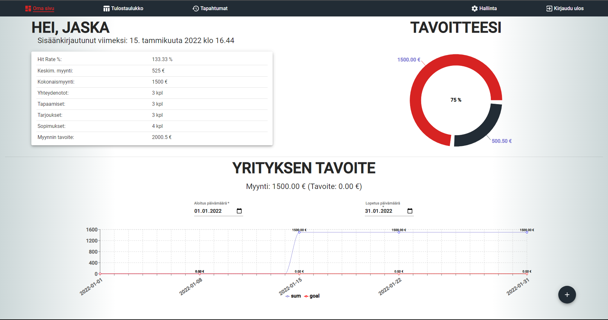

# Salesmanagement/CRM System

A full-stack blog application made as a school project for an actual client. **The backend can be found from [here](https://github.com/f4irline/salesmanagement-crm-server).**

  

## Features
- Authentication with JWT
- Admins can create, modify and remove users
- Users can add events like leads, contacts, meetings, offers and deals
  - Leads are visible to all other users as well
- Users can view all the events other users have done
- Users can view leaderboards sort of table
- Users can see their progress and sales summaries from a dashboard

## Technologies
### Frontend
- React.js
- [Axios](https://www.npmjs.com/package/axios)
  - HTTP client
- [Material UI](https://www.npmjs.com/package/@material-ui/core)
  - UI components
- [markdown-to-jsx](https://www.npmjs.com/package/markdown-to-jsx)
  - Parses markdown to JSX elements
- [react-mde](https://www.npmjs.com/package/react-mde)
  - Markdown editing capabilities for the blog
- [recharts](https://recharts.org/en-US/)
  - Charts to visualize data

### Backend
- Java (1.8)
- Spring Boot
- PostgreSQL
- Hibernate
  - ORM for database
- Authentication made with JWT